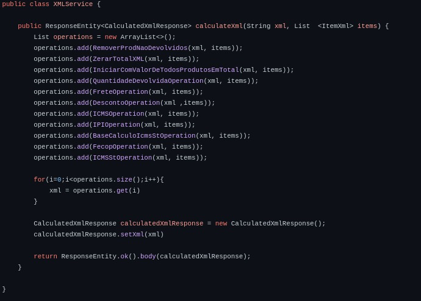
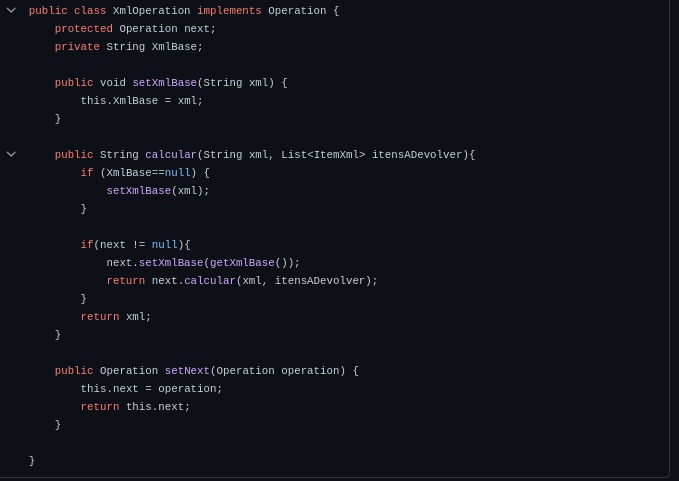
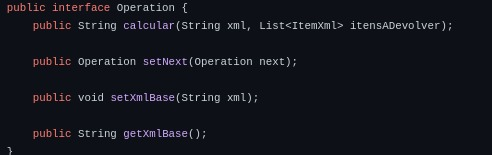
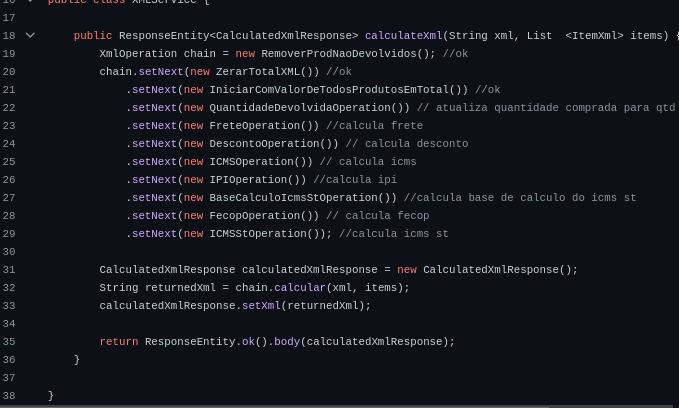
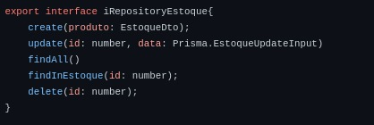
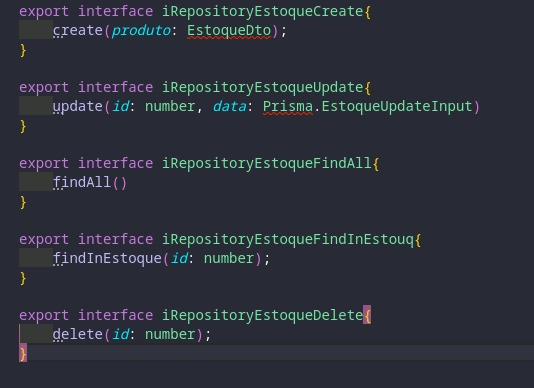
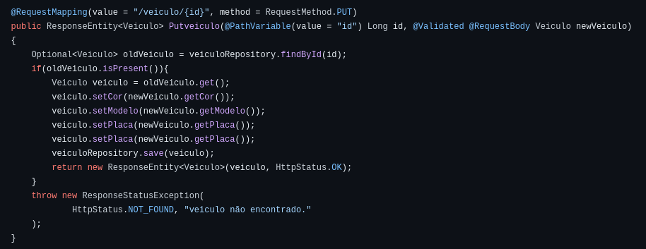
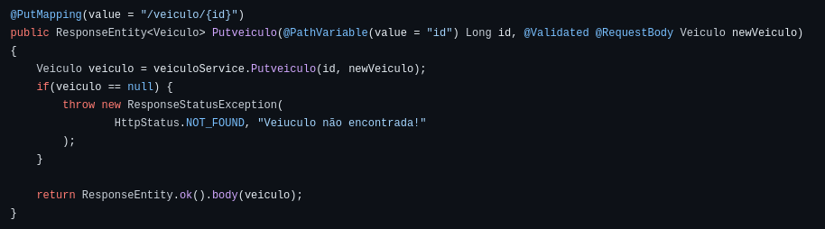
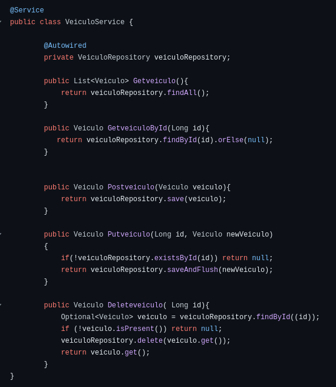
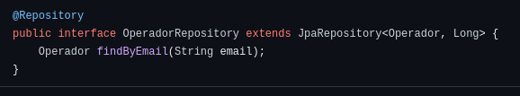

## Uso dos princípios de SOLID

### Princípio da Responsabilidade Única (SRP):

- **Definição:** Uma classe deve ter apenas uma razão para mudar.
- **Exemplo:**
  - A classe `veiculoController` é responsável por:
    - Manipular requisições HTTP.
    - Acessar o banco de dados.
    - Gerenciar as respostas HTTP.
  - **Sugestão:**
    - Separar essas responsabilidades em classes distintas.

---

### Princípio Aberto/Fechado (OCP):

- **Definição:** Uma classe deve ser aberta para extensão, mas fechada para modificação.
- **Exemplo:**
  - A classe `veiculoController` atualmente para aceitar novos tipos de operações precisa modificar todo o código existente.
  - **Sugestão:**
    - Adicionar novos métodos para diferentes tipos de operadores. Para isso, deve obedecer ao princípio da responsabilidade única.

---

### Princípio da Substituição de Liskov (LSP):

- **Definição:** O método calcular na classe altera o comportamento esperado da classe base (XmlOperation). Além de realizar a remoção de produtos não devolvidos, ele chama super.calcular(xml, itensADevolver), adicionando um comportamento adicional que a classe base não prevê. O LSP pede que a substituição de uma classe base por sua classe derivada não modifique o contrato da classe base.

---
- **Dica:**
  - A adição de uma interface comum, como Operation é crucial. e durante a execução da cadeia o método calcular da interface Operation é chamadogarantindo que cada operação pode ser invocada de maneira consistente, independentemente da implementação específica.

---

### Violação no LSP Classe xmlService
#### Antes

---

#### Depois

---

---
### Princípio da Segregação de Interface (ISP):

- **Definição:** Uma classe não deve ser forçada a implementar interfaces que ela não utiliza.
- **Dica:**
  - Se você utiliza interfaces, certificar-se de que as classes implementem apenas os métodos relevantes.

---

### Violação do princípio ISP
#### Antes

---

#### Depois

---

### Princípio da Inversão de Dependência (DIP):

- **Definição:** Dependa de abstrações, não de implementações concretas.
- **Exemplo:**
  - As dependências foram injetadas na classe `veiculoController` por meio do construtor.
  - **Sugestão:**
    - Definir a interface `veiculoController` de forma a seguir a Inversão de Controle (IoC) para maior flexibilidade e testabilidade.

---

## Classe veiculoController

### Antes e Depois

 

---

---

## Classe veiculoService

### Antes e Depois

 

---

---

## Classe veiculoRepository

